# Energy Simulator & Multi-Scenario Decision Platform — `current_model` Architecture

A modular, enterprise-grade simulation and analytics platform for electrical load profiling, real meter ingestion, electricity supply contract modeling, Solar PV generation analysis, Battery Energy Storage System (BESS) peak shaving, on-site generator peaking, and multi-scenario lifecycle investment assessment.

---

## :material/palette: UI Iconography & Visual Presentation Policy (Mandatory Guidelines)

> [!IMPORTANT]
> **1. Iconography Standard (Piktogramme & UI Icons):**
> To maintain a clean, professional, and subtle aesthetic, **exclusively Streamlit's native Google Material Symbols (`:material/<icon_name>:`)** must be used across all application tabs, sub-tabs, buttons, expanders, input controls, and headings.
> 
> * **Prohibited:** Colorful cartoon emojis must **never** be used in user-facing controls, tables, presets, or documentation.
> * **Native Streamlit Material Icons:** Use the `:material/<icon_name>:` syntax directly in widgets (e.g. `icon=":material/rocket_launch:"`, `icon=":material/restart_alt:"`, `icon=":material/download:"`, `st.tabs([":material/analytics: Consumption", ...])`).
> * **Country Flags:** Use vector Flag Icons (`fi fi-<country_code>`) or text labels where country indicators are required.
> 
> **2. Charts & Diagrams Standard (Diagramme & Visualisierungen):**
> * **Interactive Application Charts:** Use **Plotly** (`plotly.graph_objects.Figure`) exclusively for all analytical plots, timeseries, heatmaps, stacked area charts, balance bars, waterfalls, and Sankey diagrams. Static raster images (matplotlib/seaborn PNGs) are strictly prohibited.
> * **System Architecture & Flows:** Use **Mermaid** diagrams (`flowchart TD`, `sequenceDiagram`) directly in Markdown documentation.

The stylesheets and helper icons are globally injected via [`ui/common/styles.py`](file:///c:/Users/mwien/Documents/One%20drive2/OneDrive/Desktop/Arbeit%20prog/Web%20Development/entwuerfe/current_model/ui/common/styles.py).

---

## :material/map: Quick-Lookup Directory Map (1:1 Visual-to-Code Mapping)

The application follows a strictly modular architecture where every UI tab, core engine, data model, and testing suite is isolated into dedicated files:

| Layer / Component | Description & Responsibility | File Path |
| :--- | :--- | :--- |
| **Main Application Entry** | Dynamic top-level orchestrator & scenario tab builder | [`app.py`](file:///c:/Users/mwien/Documents/One%20drive2/OneDrive/Desktop/Arbeit%20prog/Web%20Development/entwuerfe/current_model/app.py) |
| **Sidebar Scenario Controller** | Multi-scenario tree manager, branch switcher & `.dracproj` project I/O | [`ui/common/sidebar_scenario_view.py`](file:///c:/Users/mwien/Documents/One%20drive2/OneDrive/Desktop/Arbeit%20prog/Web%20Development/entwuerfe/current_model/ui/common/sidebar_scenario_view.py) |
| **Global Theme & Styles** | Dark mode CSS design tokens, card classes, and icon CDNs | [`ui/common/styles.py`](file:///c:/Users/mwien/Documents/One%20drive2/OneDrive/Desktop/Arbeit%20prog/Web%20Development/entwuerfe/current_model/ui/common/styles.py) |
| **Shared KPI Components** | Metric cards (`render_kpi_card`) & active scenario banner | [`ui/common/cards.py`](file:///c:/Users/mwien/Documents/One%20drive2/OneDrive/Desktop/Arbeit%20prog/Web%20Development/entwuerfe/current_model/ui/common/cards.py) |
| **Cross-Tab Session Utils** | Active load dataset, contract discovery & summary helpers | [`ui/common/session_utils.py`](file:///c:/Users/mwien/Documents/One%20drive2/OneDrive/Desktop/Arbeit%20prog/Web%20Development/entwuerfe/current_model/ui/common/session_utils.py) |
| **Tab 1: Scenario Management** | Master multi-scenario comparison dashboard & decision matrix | [`ui/tab_comparison/view.py`](file:///c:/Users/mwien/Documents/One%20drive2/OneDrive/Desktop/Arbeit%20prog/Web%20Development/entwuerfe/current_model/ui/tab_comparison/view.py) |
| **Tab 1: Comparison Charts** | Cumulative 15-year TCO curves, CAPEX/OPEX shifts, energy balances | [`ui/tab_comparison/charts.py`](file:///c:/Users/mwien/Documents/One%20drive2/OneDrive/Desktop/Arbeit%20prog/Web%20Development/entwuerfe/current_model/ui/tab_comparison/charts.py) |
| **Tab 2: Consumption Baseline** | Switcher between Synthetic Load Simulator and CSV Real Meter Ingestion | [`ui/tab1_consumption/view.py`](file:///c:/Users/mwien/Documents/One%20drive2/OneDrive/Desktop/Arbeit%20prog/Web%20Development/entwuerfe/current_model/ui/tab1_consumption/view.py) |
| **Tab 2: Synthetic View** | 24h & 365d simulation orchestrator, KPIs, and `.drac` toolbar | [`ui/tab1_consumption/synthetic/view.py`](file:///c:/Users/mwien/Documents/One%20drive2/OneDrive/Desktop/Arbeit%20prog/Web%20Development/entwuerfe/current_model/ui/tab1_consumption/synthetic/view.py) |
| **Tab 2: Synthetic Forms** | Consumer asset configuration, operating windows, weekly schedules | [`ui/tab1_consumption/synthetic/forms.py`](file:///c:/Users/mwien/Documents/One%20drive2/OneDrive/Desktop/Arbeit%20prog/Web%20Development/entwuerfe/current_model/ui/tab1_consumption/synthetic/forms.py) |
| **Tab 2: Synthetic Charts** | Plotly 24h stacked area, 365d timeseries & 2D annual load heatmap | [`ui/tab1_consumption/synthetic/charts.py`](file:///c:/Users/mwien/Documents/One%20drive2/OneDrive/Desktop/Arbeit%20prog/Web%20Development/entwuerfe/current_model/ui/tab1_consumption/synthetic/charts.py) |
| **Tab 2: CSV Inspector View** | Ingestion pipeline, multi-meter viewer, and overload analyzer | [`ui/tab1_consumption/csv_inspector/view.py`](file:///c:/Users/mwien/Documents/One%20drive2/OneDrive/Desktop/Arbeit%20prog/Web%20Development/entwuerfe/current_model/ui/tab1_consumption/csv_inspector/view.py) |
| **Tab 2: CSV Forms** | File upload widget, delimiter sniffer, and column mapping | [`ui/tab1_consumption/csv_inspector/forms.py`](file:///c:/Users/mwien/Documents/One%20drive2/OneDrive/Desktop/Arbeit%20prog/Web%20Development/entwuerfe/current_model/ui/tab1_consumption/csv_inspector/forms.py) |
| **Tab 2: CSV Charts** | High-performance interactive multi-channel timeseries chart | [`ui/tab1_consumption/csv_inspector/charts.py`](file:///c:/Users/mwien/Documents/One%20drive2/OneDrive/Desktop/Arbeit%20prog/Web%20Development/entwuerfe/current_model/ui/tab1_consumption/csv_inspector/charts.py) |
| **Tab 3: Current Contract** | Status Quo electricity supply contract configuration and monthly bill | [`ui/tab2_contract/view.py`](file:///c:/Users/mwien/Documents/One%20drive2/OneDrive/Desktop/Arbeit%20prog/Web%20Development/entwuerfe/current_model/ui/tab2_contract/view.py) |
| **Tab 3: Contract Form** | Electricity tariff input form, TOU rates, taxes & `.drac` transfer bar | [`ui/tab2_contract/form.py`](file:///c:/Users/mwien/Documents/One%20drive2/OneDrive/Desktop/Arbeit%20prog/Web%20Development/entwuerfe/current_model/ui/tab2_contract/form.py) |
| **Tab 3: Financial Charts** | Cost distribution donut chart and monthly payment schedule series | [`ui/tab2_contract/charts.py`](file:///c:/Users/mwien/Documents/One%20drive2/OneDrive/Desktop/Arbeit%20prog/Web%20Development/entwuerfe/current_model/ui/tab2_contract/charts.py) |
| **Tab 3: Tariff Switch** | Dynamic sub-scenario tab for evaluating alternative supply contracts | [`ui/tab2_contract/view.py`](file:///c:/Users/mwien/Documents/One%20drive2/OneDrive/Desktop/Arbeit%20prog/Web%20Development/entwuerfe/current_model/ui/tab2_contract/view.py) |
| **Tab 4: Solar + BESS (Beta)** | Standalone isolated Solar PV + BESS hybrid dispatch simulator (Beta) | [`ui/tab_hybrid_beta/view.py`](file:///c:/Users/mwien/Documents/One%20drive2/OneDrive/Desktop/Arbeit%20prog/Web%20Development/entwuerfe/current_model/ui/tab_hybrid_beta/view.py) |
| **Tab 4: Hybrid Charts** | 15-min hybrid dispatch curve, stacked BESS SoC profile, monthly balance & tables | [`ui/tab_hybrid_beta/charts.py`](file:///c:/Users/mwien/Documents/One%20drive2/OneDrive/Desktop/Arbeit%20prog/Web%20Development/entwuerfe/current_model/ui/tab_hybrid_beta/charts.py) |
| **Dynamic Tab: Solar PV** | Standalone physical generation simulator & load coupling integration | [`ui/tab3_solar/view.py`](file:///c:/Users/mwien/Documents/One%20drive2/OneDrive/Desktop/Arbeit%20prog/Web%20Development/entwuerfe/current_model/ui/tab3_solar/view.py) |
| **Solar Forms & Physics** | Module sizing, tilt/azimuth, GPS coordinates & Perez loss factors | [`ui/tab3_solar/forms.py`](file:///c:/Users/mwien/Documents/One%20drive2/OneDrive/Desktop/Arbeit%20prog/Web%20Development/entwuerfe/current_model/ui/tab3_solar/forms.py) |
| **Solar Standalone Charts** | 15-min generation curve, monthly yields, loss waterfall & tech matrix | [`ui/tab3_solar/charts.py`](file:///c:/Users/mwien/Documents/One%20drive2/OneDrive/Desktop/Arbeit%20prog/Web%20Development/entwuerfe/current_model/ui/tab3_solar/charts.py) |
| **Solar Integration View** | Solar-load coupling, auto-sizing (40-100%), SCR & Autarky KPIs | [`ui/tab3_solar/integration_view.py`](file:///c:/Users/mwien/Documents/One%20drive2/OneDrive/Desktop/Arbeit%20prog/Web%20Development/entwuerfe/current_model/ui/tab3_solar/integration_view.py) |
| **Solar Integration Charts**| 15-min dispatch timeseries, monthly balance, seasonal & Sankey | [`ui/tab3_solar/integration_charts.py`](file:///c:/Users/mwien/Documents/One%20drive2/OneDrive/Desktop/Arbeit%20prog/Web%20Development/entwuerfe/current_model/ui/tab3_solar/integration_charts.py) |
| **Dynamic Tab: BESS** | Battery peak shaving dispatch & financial viability assessment | [`ui/tab4_bess/view.py`](file:///c:/Users/mwien/Documents/One%20drive2/OneDrive/Desktop/Arbeit%20prog/Web%20Development/entwuerfe/current_model/ui/tab4_bess/view.py) |
| **BESS Physical Charts** | 15-min battery dispatch, SoC envelope, representative week profile | [`ui/tab4_bess/charts.py`](file:///c:/Users/mwien/Documents/One%20drive2/OneDrive/Desktop/Arbeit%20prog/Web%20Development/entwuerfe/current_model/ui/tab4_bess/charts.py) |
| **BESS Financial View** | Turnkey CAPEX breakdown, demand charge savings, NPV, IRR, Payback | [`ui/tab4_bess/financial_view.py`](file:///c:/Users/mwien/Documents/One%20drive2/OneDrive/Desktop/Arbeit%20prog/Web%20Development/entwuerfe/current_model/ui/tab4_bess/financial_view.py) |
| **BESS Financial Charts** | CAPEX donut chart, cash flow waterfall, sensitivity matrix | [`ui/tab4_bess/financial_charts.py`](file:///c:/Users/mwien/Documents/One%20drive2/OneDrive/Desktop/Arbeit%20prog/Web%20Development/entwuerfe/current_model/ui/tab4_bess/financial_charts.py) |
| **Dynamic Tab: Generator / Genset** | Peaking & residual backup generator dispatch view | [`ui/tab_generator/view.py`](file:///c:/Users/mwien/Documents/One%20drive2/OneDrive/Desktop/Arbeit%20prog/Web%20Development/entwuerfe/current_model/ui/tab_generator/view.py) |
| **Generator Charts** | Multi-layer hybrid dispatch curve & cumulative payment schedule | [`ui/tab_generator/charts.py`](file:///c:/Users/mwien/Documents/One%20drive2/OneDrive/Desktop/Arbeit%20prog/Web%20Development/entwuerfe/current_model/ui/tab_generator/charts.py) |
| **Project & Scenario I/O** | Snapshot engine for `.dracproj` projects & `.drac` modular assets | [`core/project_io.py`](file:///c:/Users/mwien/Documents/One%20drive2/OneDrive/Desktop/Arbeit%20prog/Web%20Development/entwuerfe/current_model/core/project_io.py) |
| **Synthetic Load Engine** | Vectorized 24h & 365-day annual load simulation with seasonal shifts | [`core/synthetic_engine.py`](file:///c:/Users/mwien/Documents/One%20drive2/OneDrive/Desktop/Arbeit%20prog/Web%20Development/entwuerfe/current_model/core/synthetic_engine.py) |
| **CSV Parser & Cleanser** | Auto-delimiter sniffer, European comma parser, resampling | [`core/csv_parser.py`](file:///c:/Users/mwien/Documents/One%20drive2/OneDrive/Desktop/Arbeit%20prog/Web%20Development/entwuerfe/current_model/core/csv_parser.py) |
| **Load Processor Engine** | Load data normalization, unit conversion (kW/kWh), validation | [`core/load_processor.py`](file:///c:/Users/mwien/Documents/One%20drive2/OneDrive/Desktop/Arbeit%20prog/Web%20Development/entwuerfe/current_model/core/load_processor.py) |
| **Metrics Engine** | Peak demand, load factor, base load, duration curve analytics | [`core/metrics_engine.py`](file:///c:/Users/mwien/Documents/One%20drive2/OneDrive/Desktop/Arbeit%20prog/Web%20Development/entwuerfe/current_model/core/metrics_engine.py) |
| **Contract Billing Engine** | TOU matching, capacity penalties, dynamic taxes, invoice schedules | [`core/financial_engine.py`](file:///c:/Users/mwien/Documents/One%20drive2/OneDrive/Desktop/Arbeit%20prog/Web%20Development/entwuerfe/current_model/core/financial_engine.py) |
| **Solar Physics Engine** | Solar geometry, Perez transposition, cell temperature, clipping, diurnal calendar alignment | [`core/solar_engine.py`](file:///c:/Users/mwien/Documents/One%20drive2/OneDrive/Desktop/Arbeit%20prog/Web%20Development/entwuerfe/current_model/core/solar_engine.py) |
| **Solar Financial Engine** | Solar LCOE, NPV, IRR, amortisation payback, 15-year cashflows | [`core/solar_financial_engine.py`](file:///c:/Users/mwien/Documents/One%20drive2/OneDrive/Desktop/Arbeit%20prog/Web%20Development/entwuerfe/current_model/core/solar_financial_engine.py) |
| **BESS Dispatch Engine** | 15-min interval battery dispatch, SoC boundaries, grid peak shaving | [`core/bess_engine.py`](file:///c:/Users/mwien/Documents/One%20drive2/OneDrive/Desktop/Arbeit%20prog/Web%20Development/entwuerfe/current_model/core/bess_engine.py) |
| **BESS Financial Engine** | BESS investment economics, demand charge savings, sensitivity | [`core/bess_financial_engine.py`](file:///c:/Users/mwien/Documents/One%20drive2/OneDrive/Desktop/Arbeit%20prog/Web%20Development/entwuerfe/current_model/core/bess_financial_engine.py) |
| **Solar + BESS Hybrid Engine** | 15-min joint dispatch: PV direct -> BESS charge -> grid export -> BESS peak shave (with diurnal calendar alignment) | [`core/solar_bess_engine.py`](file:///c:/Users/mwien/Documents/One%20drive2/OneDrive/Desktop/Arbeit%20prog/Web%20Development/entwuerfe/current_model/core/solar_bess_engine.py) |
| **DRACBV Peaking Engine** | Generator peaking simulation, fuel consumption, rental/purchase OPEX | [`core/dracbv_engine.py`](file:///c:/Users/mwien/Documents/One%20drive2/OneDrive/Desktop/Arbeit%20prog/Web%20Development/entwuerfe/current_model/core/dracbv_engine.py) |
| **Scenario Domain Models** | `BaseScenario`, `SubScenario`, `ProjectContainer` domain structures | [`models/scenario.py`](file:///c:/Users/mwien/Documents/One%20drive2/OneDrive/Desktop/Arbeit%20prog/Web%20Development/entwuerfe/current_model/models/scenario.py) |
| **Contract Domain Model** | `Contract`, TOU rate windows, taxes, capacity charges | [`models/contract.py`](file:///c:/Users/mwien/Documents/One%20drive2/OneDrive/Desktop/Arbeit%20prog/Web%20Development/entwuerfe/current_model/models/contract.py) |
| **Solar Domain Models** | `SolarPVConfig`, `SolarLocation`, `SolarKPIs`, `SolarSimulationResult` | [`models/solar.py`](file:///c:/Users/mwien/Documents/One%20drive2/OneDrive/Desktop/Arbeit%20prog/Web%20Development/entwuerfe/current_model/models/solar.py) |
| **BESS Domain Models** | `BESSConfig`, `BESSKPIs`, modular sizing, chemistry presets | [`models/bess.py`](file:///c:/Users/mwien/Documents/One%20drive2/OneDrive/Desktop/Arbeit%20prog/Web%20Development/entwuerfe/current_model/models/bess.py) |
| **Generator Domain Models** | `GeneratorConfig`, `GeneratorKPIs`, fuel types, rental vs purchase | [`models/generator.py`](file:///c:/Users/mwien/Documents/One%20drive2/OneDrive/Desktop/Arbeit%20prog/Web%20Development/entwuerfe/current_model/models/generator.py) |
| **DRACBV Domain Models** | Multi-path classification & parameters for grid constraint problems | [`models/dracbv.py`](file:///c:/Users/mwien/Documents/One%20drive2/OneDrive/Desktop/Arbeit%20prog/Web%20Development/entwuerfe/current_model/models/dracbv.py) |
| **Load Component Models** | `SimpleConsumer`, `TimeWindow`, `LoadComponent` data classes | [`models/load_component.py`](file:///c:/Users/mwien/Documents/One%20drive2/OneDrive/Desktop/Arbeit%20prog/Web%20Development/entwuerfe/current_model/models/load_component.py) |
| **Grid Limit & Overload** | `GridLimitConfig`, `OverloadAnalysisResult` definitions | [`models/grid_limit.py`](file:///c:/Users/mwien/Documents/One%20drive2/OneDrive/Desktop/Arbeit%20prog/Web%20Development/entwuerfe/current_model/models/grid_limit.py) |
| **Financial Cost Models** | `CostLineItem`, `MonthlyPaymentRecord`, `FinancialCostBreakdown` | [`models/financial.py`](file:///c:/Users/mwien/Documents/One%20drive2/OneDrive/Desktop/Arbeit%20prog/Web%20Development/entwuerfe/current_model/models/financial.py) |
| **Calendar Models** | `CalendarConfig`, holiday calendars, weekend off-peak logic | [`models/calendar_config.py`](file:///c:/Users/mwien/Documents/One%20drive2/OneDrive/Desktop/Arbeit%20prog/Web%20Development/entwuerfe/current_model/models/calendar_config.py) |
| **Preset Templates** | Industry, Office, EV-Hub load consumers and contract presets | [`models/presets.py`](file:///c:/Users/mwien/Documents/One%20drive2/OneDrive/Desktop/Arbeit%20prog/Web%20Development/entwuerfe/current_model/models/presets.py) |
| **UI Testing Sandbox Lab** | Isolated Streamlit playground for UI prototyping & widget testing | [`ui_sandbox/sandbox_app.py`](file:///c:/Users/mwien/Documents/One%20drive2/OneDrive/Desktop/Arbeit%20prog/Web%20Development/entwuerfe/current_model/ui_sandbox/sandbox_app.py) |
| **Minimal Contract Lab** | Streamlined Electricity Contract & Consumption sandbox module | [`ui_sandbox/minimal_contract_system.py`](file:///c:/Users/mwien/Documents/One%20drive2/OneDrive/Desktop/Arbeit%20prog/Web%20Development/entwuerfe/current_model/ui_sandbox/minimal_contract_system.py) |
| **Sandbox Architecture Doc** | Sandbox rules, one-way dependency isolation, quick-start guide | [`ui_sandbox/README.md`](file:///c:/Users/mwien/Documents/One%20drive2/OneDrive/Desktop/Arbeit%20prog/Web%20Development/entwuerfe/current_model/ui_sandbox/README.md) |
| **Automated Test Runner** | Regression & health-check runner (130 automated unit tests) | [`run_tests.py`](file:///c:/Users/mwien/Documents/One%20drive2/OneDrive/Desktop/Arbeit%20prog/Web%20Development/entwuerfe/current_model/run_tests.py) |


---

## :material/account_tree: System Architecture & Workflow

The platform operates on a **1-to-N Scenario Paradigm**:
* **Base Scenario (`BaseScenario`):** Represents the immutable **Status Quo** benchmark (the facility's baseline load profile and current utility supply contract).
* **Sub-Scenarios (`SubScenario`):** Independent proposed intervention branches where users can activate any combination of hardware and commercial options:
  * Solar Photovoltaic Generation (`include_solar`)
  * Battery Energy Storage System (`include_bess`)
  * Alternative Grid Supply Tariff (`use_custom_grid_tariff`)
  * On-Site Peaking Generator (`include_generator`)
* **Project Container (`ProjectContainer`):** Multi-scenario workspace that serializes the complete state into `.dracproj` JSON bundles.

```mermaid
flowchart TD
    subgraph UI ["User Interface Layer (Streamlit)"]
        Sidebar["Sidebar: Scenario Controller & .dracproj I/O"]
        Tab1["Tab 1: Scenario Management & Decision Matrix"]
        Tab2["Tab 2: Consumption Baseline (Synthetic & CSV)"]
        Tab3["Tab 3: Current Contract (Status Quo)"]
        Tab4["Tab 4: DRACBV Peaking Simulator (Beta)"]
        
        subgraph DynamicTabs ["Dynamic Active Solution Tabs"]
            TabSolar["Solar PV Generation (if include_solar)"]
            TabBESS["Battery Storage BESS (if include_bess)"]
            TabTariff["Tariff Switch (if use_custom_grid_tariff)"]
            TabGen["Generator / Genset (if include_generator)"]
        end
    end

    subgraph Persistence ["Persistence Layer (.dracproj & .drac)"]
        ProjIO["Project I/O Engine (project_io.py)"]
        FileProj[".dracproj (Full Multi-Scenario Workspace)"]
        FileContract[".drac (Contract Schema)"]
        FileProfile[".drac (Profile Schema)"]
    end

    subgraph CoreEngines ["Core Calculation Engines"]
        SyntheticEngine["Synthetic Load Engine (24h / 365d)"]
        CSVEngine["CSV Parser & Time Processor"]
        BillingEngine["Contract Billing & Financial Engine"]
        SolarEngine["Solar Physics Engine (Perez Model)"]
        SolarFinEngine["Solar Financial Engine (LCOE/NPV)"]
        BESSEngine["BESS Dispatch Engine (15-min Shaving)"]
        BESSFinEngine["BESS Financial Engine (Capex & Savings)"]
        DRACBVEngine["DRACBV Peaking Engine (Genset Dispatch)"]
    end

    subgraph DataModels ["Domain Data Models"]
        ModelProj["ProjectContainer & SubScenario"]
        ModelLoad["SimpleConsumer & TimeWindow"]
        ModelContract["Contract (TOU & Taxes)"]
        ModelSolar["SolarPVConfig & SimulationResult"]
        ModelBESS["BESSConfig & BESSKPIs"]
        ModelGen["GeneratorConfig & GeneratorKPIs"]
    end

    Sidebar <--> ProjIO
    ProjIO <--> FileProj
    FileContract <--> Tab3
    FileProfile <--> Tab2

    Tab1 <--> CoreEngines
    Tab2 <--> SyntheticEngine
    Tab2 <--> CSVEngine
    Tab3 <--> BillingEngine
    TabSolar <--> SolarEngine
    TabSolar <--> SolarFinEngine
    TabBESS <--> BESSEngine
    TabBESS <--> BESSFinEngine
    Tab4 <--> DRACBVEngine
    TabGen <--> DRACBVEngine

    ProjIO --> ModelProj
    SyntheticEngine --> ModelLoad
    BillingEngine --> ModelContract
    SolarEngine --> ModelSolar
    BESSEngine --> ModelBESS
    DRACBVEngine --> ModelGen

    Tab2 -.->|Active Baseline Load| Tab1
    Tab3 -.->|Status Quo Rates| Tab1
    TabSolar -.->|Solar Generation| Tab1
    TabBESS -.->|BESS Dispatch| Tab1
    TabGen -.->|Generator Generation & Costs| Tab1
```



---

## :material/widgets: Dynamic Tab Navigation Architecture

The main entry point [`app.py`](file:///c:/Users/mwien/Documents/One%20drive2/OneDrive/Desktop/Arbeit%20prog/Web%20Development/entwuerfe/current_model/app.py) organizes navigation dynamically:

1. **Base Navigation Tabs (Always Rendered):**
   * **1. Scenario Management:** Central leaderboard, 15-year TCO curves, energy balances, and comparative analytics.
   * **2. Consumption (Baseline):** Profile definition via bottom-up synthetic simulation or real smart meter CSV ingestion.
   * **3. Current Contract (Status Quo):** Baseline electricity contract, TOU rates, capacity fees, and bill decomposition.
   * **4. Solar + BESS (Beta):** Standalone isolated Solar PV + BESS hybrid dispatch simulator.

2. **Dynamic Solution Module Tabs (Appended Based on Active Sub-Scenario):**
   * If `active_sub.include_solar == True`: **Solar PV Generation** tab appears.
   * If `active_sub.include_bess == True`: **Battery Storage (BESS)** tab appears.
   * If `active_sub.use_custom_grid_tariff == True`: **Tariff Switch / Alternative Contract** tab appears.
   * If `active_sub.include_generator == True`: **Generator / Genset** tab appears (Standalone Peaker or Hybrid Residual Backup).

If the active scenario is set to **Status Quo (Base Scenario)**, the application displays an active Status Quo banner and provides one-click branch buttons to switch to or create sub-scenario branches.

---

## :material/view_compact: Detailed Module Breakdown

### 1. Tab 1: Scenario Management & Executive Decision Matrix
* **Multi-Scenario Comparison View ([`ui/tab_comparison/view.py`](file:///c:/Users/mwien/Documents/One%20drive2/OneDrive/Desktop/Arbeit%20prog/Web%20Development/entwuerfe/current_model/ui/tab_comparison/view.py))**:
  * **Active Scenario Cards**: Instant visual switching between Status Quo and all configured sub-scenarios.
  * **Sub-Tab 1.1 Financial Benchmarks & Amortisation**:
    * Executive KPI Summary: Lowest Total Cost of Ownership (TCO), Highest 15-Year Savings, Fastest Payback, Maximum Autarky.
    * Parameter Delta Matrix: Direct comparison of hardware capacities (kWp PV, kWh BESS, kW Generator) and contract terms.
    * Scenario Ranking Leaderboard: Evaluates net present value (NPV), internal rate of return (IRR), and capital expenditure (CAPEX).
    * Scope-Adaptive 15-Year Cumulative Cost Curves: Switches between *Full Facility TCO* (including grid bills) and *Standalone Intervention Investment* views.
    * CAPEX vs. OPEX Capital Shift: Stacked bar chart contrasting operational utility spend against amortized capital investments.
    * Autarky & Payback Trade-off: Scatter plot identifying the economic sweet spot.
  * **Sub-Tab 1.2 Electrical Energy & Power Balance**:
    * Energy balance KPIs: Baseline demand, on-site solar generation, direct self-consumption, residual grid draw, surplus export.
    * Peak demand shaving ($\Delta kW$) and annual carbon emission reductions ($t\text{CO}_2/a$).
    * Annual energy balance bars and residual grid load duration comparison curves.

---

### 2. Tab 2: Consumption Baseline Modeling & Smart Meter Ingestion
* **Bottom-Up Synthetic Simulation ([`core/synthetic_engine.py`](file:///c:/Users/mwien/Documents/One%20drive2/OneDrive/Desktop/Arbeit%20prog/Web%20Development/entwuerfe/current_model/core/synthetic_engine.py))**:
  * **24-Hour Profile**: Generates 96 fifteen-minute power intervals ($kW$) for daily operational cycles.
  * **Full Year (365 Days / 35,040 Steps)**: Vectorized simulation applying day-of-week masks (Monday to Sunday), inrush startup spikes, monthly seasonal scaling factors (summer/winter variations), and system-wide custom holidays (automatically treated as Sunday schedules).
* **Smart Meter CSV Parser & Pipeline ([`core/csv_parser.py`](file:///c:/Users/mwien/Documents/One%20drive2/OneDrive/Desktop/Arbeit%20prog/Web%20Development/entwuerfe/current_model/core/csv_parser.py), [`core/load_processor.py`](file:///c:/Users/mwien/Documents/One%20drive2/OneDrive/Desktop/Arbeit%20prog/Web%20Development/entwuerfe/current_model/core/load_processor.py))**:
  * Auto-detects delimiters (`,`, `;`, `\t`), European comma decimals (`1.234,56`), and multi-language timestamp formats (Spanish, English, German).
  * Automatically converts energy intervals into active power demand ($15\text{-min-kWh} \times 4 \to \text{kW}$).
  * Resamples and filters arbitrary date ranges.
* **Grid Capacity Overload Analysis ([`models/grid_limit.py`](file:///c:/Users/mwien/Documents/One%20drive2/OneDrive/Desktop/Arbeit%20prog/Web%20Development/entwuerfe/current_model/models/grid_limit.py))**:
  * Evaluates load against contracted physical capacity limits, quantifying peak overload ($kW$), duration ($hours$), and excess energy ($kWh$).

---

### 3. Tab 3: Electricity Contract & Billing Engine
* **Contract Domain Model ([`models/contract.py`](file:///c:/Users/mwien/Documents/One%20drive2/OneDrive/Desktop/Arbeit%20prog/Web%20Development/entwuerfe/current_model/models/contract.py))**:
  * **Capacity & Demand Tariffs**: Fixed base monthly charge, contracted active capacity charge ($/kW/month$), and measured peak demand fee ($/kW/month$).
  * **Dynamic Time-of-Use (TOU) Rates**: Configurable table of tariff intervals (*Peak/Pico*, *Shoulder/Resto*, *Off-Peak/Valle*) with overnight interval support and weekend off-peak rules.
  * **Power Factor & Reactive Penalties**: $\cos\phi$ threshold monitoring and excess reactive energy charges ($/kVARh$).
  * **Dynamic Taxes & Levies**: Percentage-based taxes (VAT, provincial surcharges), per-kWh levies, and fixed monthly charges.
* **Financial Billing Engine ([`core/financial_engine.py`](file:///c:/Users/mwien/Documents/One%20drive2/OneDrive/Desktop/Arbeit%20prog/Web%20Development/entwuerfe/current_model/core/financial_engine.py))**:
  * Couples dynamically with the active load profile.
  * Generates itemized monthly cost breakdowns, effective unit costs ($/kWh$), fixed vs. variable cost splits, and full 12-month payment schedules (*Zahlungsreihe*).
* **Dynamic Tariff Switcher ([`ui/tab2_contract/view.py`](file:///c:/Users/mwien/Documents/One%20drive2/OneDrive/Desktop/Arbeit%20prog/Web%20Development/entwuerfe/current_model/ui/tab2_contract/view.py))**:
  * Evaluates alternative electricity supply contracts for sub-scenarios, calculating direct annual cost savings and bill reductions against the Status Quo.

---

### 4. Tab 4: DRACBV Generator Peaking Simulator (Beta)
* **Generator Peaking Engine ([`core/dracbv_engine.py`](file:///c:/Users/mwien/Documents/One%20drive2/OneDrive/Desktop/Arbeit%20prog/Web%20Development/entwuerfe/current_model/core/dracbv_engine.py), [`models/generator.py`](file:///c:/Users/mwien/Documents/One%20drive2/OneDrive/Desktop/Arbeit%20prog/Web%20Development/entwuerfe/current_model/models/generator.py))**:
  * Simulates 15-minute generator dispatch to bridge facility peak demand exceeding contracted grid limits.
  * Models fuel consumption curves for Diesel, Natural Gas, and HVO/Biofuel.
  * Evaluates rental mode (monthly leasing fee) vs. capital purchase mode (turnkey CAPEX).
  * Computes operating hours, fuel OPEX, maintenance service fees per running hour, and cumulative payment schedules.

---

### 5. Tab 5: Solar PV + BESS Hybrid Simulator (Beta - Physical Dispatch)
* **Hybrid Simulation Engine ([`core/solar_bess_engine.py`](file:///c:/Users/mwien/Documents/One%20drive2/OneDrive/Desktop/Arbeit%20prog/Web%20Development/entwuerfe/current_model/core/solar_bess_engine.py))**:
  * **Isolated Architecture**: Operates as a self-contained exploratory tab reading active facility load and contracted grid limit in read-only mode without financial overhead or sub-scenario state mutations.
  * **Priority Energy Flow Ladder**:
    1. *Solar Direct Supply*: $P_{\text{Direct}}(t) = \min(P_{\text{Load}}(t), P_{\text{Solar}}(t))$.
    2. *Solar Surplus to BESS*: Excess solar charges the battery ($P_{\text{BESS,chg,PV}}$) up to $P_{\text{chg,max}}$ and $\text{SoC}_{\max}$.
    3. *Grid Feed-in / Export*: Any remaining solar surplus after battery full charge is exported to the grid ($P_{\text{Grid,Export}}$).
    4. *BESS Peak Shaving Discharge*: When residual load exceeds the target limit ($P_{\text{Residual}} > P_{\text{Target}}$), the battery discharges ($P_{\text{BESS,dis}}$) to shave the peak down to $P_{\text{Target}}$.
    5. *Utility Grid Recharging*: When solar power is unavailable/insufficient and residual load is below target limit ($P_{\text{Residual}} < P_{\text{Target}}$), the battery recharges from available grid headroom ($P_{\text{BESS,chg,Grid}} = \min(P_{\text{Target}} - P_{\text{Residual}}, P_{\text{chg,max}}, P_{\text{room}})$) when `allow_grid_charging` is enabled.
    6. *Residual Grid Import*: Net grid import covers remaining unmet facility demand plus any battery grid recharging.
  * **Physical KPIs**: Solar generation, autarky / solar fraction (%), combined self-consumption (direct + battery stored), avoided grid import, peak demand shaved ($\Delta kW$), full equivalent battery cycles, grid recharge throughput, and grid overload violations eliminated.
  * **Interactive Visualizations ([`ui/tab_hybrid_beta/charts.py`](file:///c:/Users/mwien/Documents/One%20drive2/OneDrive/Desktop/Arbeit%20prog/Web%20Development/entwuerfe/current_model/ui/tab_hybrid_beta/charts.py))**: 15-minute multi-layer dispatch curve with stacked synchronous State of Charge (SoC %) and Stored Energy (kWh) envelope, monthly energy balance bars, and monthly summary metrics with solar vs grid charge breakdowns.

---

### 6. Dynamic Tab: Solar PV Generation & Facility Integration
* **Sub-Tab 6.1 Standalone Solar PV Physics ([`core/solar_engine.py`](file:///c:/Users/mwien/Documents/One%20drive2/OneDrive/Desktop/Arbeit%20prog/Web%20Development/entwuerfe/current_model/core/solar_engine.py))**:
  * Solar geometry: solar zenith, solar elevation, tilt, and azimuth angles.
  * Perez anisotropic sky model for transposition of Direct Normal (DNI), Diffuse Horizontal (DHI), and Global Horizontal (GHI) irradiance onto tilted planes.
  * Dynamic cell temperature modeling: $T_{\text{cell}} = T_{\text{amb}} + G_{\text{POA}} \times \frac{\text{NMOT} - 20}{800}$.
  * Thermal derating: $\eta_{\text{temp}} = 1.0 - \max(0, T_{\text{cell}} - 25^\circ\text{C}) \times \frac{|\gamma|}{100}$.
  * Inverter AC clipping and conversion threshold.
  * Multi-technology degradation matrix (PERC, TOPCon, Backcontact) over 15-year life cycles.
  * 10-year climatological risk analysis (P50, P90 debt-financing threshold, P95).
* **Sub-Tab 6.2 Facility Load Coupling & Dispatch ([`ui/tab3_solar/integration_view.py`](file:///c:/Users/mwien/Documents/One%20drive2/OneDrive/Desktop/Arbeit%20prog/Web%20Development/entwuerfe/current_model/ui/tab3_solar/integration_view.py))**:
  * Automated load coupling with active Tab 2 consumption profile.
  * Target net coverage auto-sizing (40%, 60%, 80%, 100% Net Zero annual demand).
  * Interval-by-interval electrical balance ($dt = 0.25h$): Direct self-consumption, surplus export, residual grid load.
  * Key performance metrics: Self-Consumption Rate (SCR), Solar Fraction / Autarky (SF), peak shaving ($\Delta kW$).
  * Avoided cost calculation using active Tab 3 contract tariff rates.

---

### 7. Dynamic Tab: Battery Energy Storage System (BESS)
* **Sub-Tab 7.1 Technical Peak Shaving & Simulation ([`core/bess_engine.py`](file:///c:/Users/mwien/Documents/One%20drive2/OneDrive/Desktop/Arbeit%20prog/Web%20Development/entwuerfe/current_model/core/bess_engine.py), [`models/bess.py`](file:///c:/Users/mwien/Documents/One%20drive2/OneDrive/Desktop/Arbeit%20prog/Web%20Development/entwuerfe/current_model/models/bess.py))**:
  * Modular battery sizing ($Units \times kWh = Nominal\ Capacity$).
  * Chemistry selection: Lithium Iron Phosphate (LFP), Nickel Manganese Cobalt (NMC), Vanadium Redox Flow, and Solid-State.
  * Technical constraints: Charge/discharge limits, live C-Rate validation, round-trip efficiency, and safe State-of-Charge envelope ($SoC_{\min} \le SoC(t) \le SoC_{\max}$).
  * Interval-by-interval peak shaving dispatch against a target grid cap ($kW$).
  * Automated off-peak recharge scheduling.
  * Grid violation diagnostics: Peak overload reduction, elimination percentage, annual throughput ($MWh$), and Equivalent Full Cycles (EFC).
  * Representative 7-day average week dispatch profiling.
* **Sub-Tab 7.2 Financial & Commercial Viability ([`core/bess_financial_engine.py`](file:///c:/Users/mwien/Documents/One%20drive2/OneDrive/Desktop/Arbeit%20prog/Web%20Development/entwuerfe/current_model/core/bess_financial_engine.py), [`ui/tab4_bess/financial_view.py`](file:///c:/Users/mwien/Documents/One%20drive2/OneDrive/Desktop/Arbeit%20prog/Web%20Development/entwuerfe/current_model/ui/tab4_bess/financial_view.py))**:
  * Itemized turnkey CAPEX breakdown: Battery packs, PCS inverter, balance of plant (BOP), installation, and commissioning.
  * Annual financial savings from grid capacity charge reduction and demand fee avoidance.
  * Full lifecycle cashflow schedule: Simple payback, discounted payback, Net Present Value (NPV), and Internal Rate of Return (IRR).
  * 2D Sensitivity Matrix: Variations in battery CAPEX ($/kWh$) versus grid demand charges ($/kW/month$).

---

### 8. Dynamic Tab: Generator / Genset (Peaking & Residual Backup Dispatch)
* **Context-Aware Multi-Mode Architecture ([`ui/tab_generator/view.py`](file:///c:/Users/mwien/Documents/One%20drive2/OneDrive/Desktop/Arbeit%20prog/Web%20Development/entwuerfe/current_model/ui/tab_generator/view.py))**:
  * **Standalone Peaking Mode**: Operates when the sub-scenario includes a generator without Solar or BESS. The generator covers baseline demand directly or shaves facility peak demand exceeding the contracted grid capacity limit.
  * **Hybrid Residual Backup Mode**: Automatically activates when Solar PV and/or BESS are co-enabled in the same sub-scenario. The generator operates downstream as a residual backup, covering unmet net demand left after Solar direct self-consumption and Battery discharge.
* **Dispatch Physics & Engine Pipeline ([`core/dracbv_engine.py`](file:///c:/Users/mwien/Documents/One%20drive2/OneDrive/Desktop/Arbeit%20prog/Web%20Development/entwuerfe/current_model/core/dracbv_engine.py))**:
  * **Sequential Multi-Asset Dispatch (`simulate_hybrid_scenario_dispatch`)**:
    1. *Solar Direct*: Load is first met by available instantaneous PV generation ($P_{\text{Direct}} = \min(P_{\text{Load}}, P_{\text{Solar}})$).
    2. *Solar Surplus to BESS*: Excess PV energy charges the battery up to maximum charge power and SoC limits.
    3. *BESS Discharge*: Battery discharges to cover evening deficits or shave peaks above target grid limit.
    4. *Generator Dispatch*: Generator activates to cover remaining residual demand or peak deficits according to `backup_coverage_pct`.
    5. *Residual Grid Import*: Net remaining load is supplied by the utility grid.
  * **Engine Sizing & Fuel Economics**:
    * Sizing: Rated electrical capacity ($kW$), minimum operating threshold ($kW$).
    * Fuel types: Diesel ($0.27\,\text{l/kWh}$), Natural Gas ($0.28\,\text{m}^3\text{/kWh}$), and Biofuel/HVO ($0.29\,\text{l/kWh}$).
    * Quadratic and linear fuel consumption curves factoring no-load baseline consumption and electrical efficiency.
    * Commercial options: Turnkey CAPEX purchase ($/kW$) vs. Rental leasing ($/month$), operating maintenance fee ($/\text{operating hour}$).
    * Startup cycles: Tracking of ignition events and generator starts count.
* **Interactive Visualizations & Financial Schedules ([`ui/tab_generator/charts.py`](file:///c:/Users/mwien/Documents/One%20drive2/OneDrive/Desktop/Arbeit%20prog/Web%20Development/entwuerfe/current_model/ui/tab_generator/charts.py))**:
  * Interactive Plotly 15-minute dispatch timeseries showing Solar direct, BESS discharge, Genset generation, and residual grid draw.
  * Monthly metrics table with operating hours, fuel volume, fuel OPEX, maintenance cost, and cumulative lifecycle payment schedule.
* **Tab 1 Leaderboard Integration ([`ui/tab_comparison/view.py`](file:///c:/Users/mwien/Documents/One%20drive2/OneDrive/Desktop/Arbeit%20prog/Web%20Development/entwuerfe/current_model/ui/tab_comparison/view.py))**:
  * Fully integrates generator CAPEX/rental, fuel OPEX, and maintenance spend into 15-year TCO curves, cashflow schedules, and electrical balance sheets.

---

## :material/save: Project Persistence & File Format Standards

The platform supports two persistence formats:

### 1. Full Multi-Scenario Project Container (`.dracproj`)
Serializes the entire project workspace into an atomic JSON snapshot:
* Project metadata (name, description, author, creation timestamp, active currency).
* Complete `BaseScenario` (baseline consumption consumers, CSV data records, status quo contract, location).
* All configured `SubScenario` instances with their modular opt-in flags, solar configs, BESS configs, generator configs, and alternative contracts.
* Active sub-scenario pointer.

```json
{
  "format": "drac_project",
  "version": "1.0",
  "name": "Winery Energy Optimization",
  "currency": "EUR",
  "base_scenario": {
    "name": "Status Quo (Base Scenario)",
    "load_source_type": "synthetic",
    "consumers": [ ... ],
    "base_contract": { ... }
  },
  "sub_scenarios": [
    {
      "id": "a1b2c3d4",
      "name": "Option 1: Solar + BESS",
      "include_solar": true,
      "include_bess": true,
      "solar_config": { ... },
      "bess_config": { ... }
    }
  ],
  "active_sub_scenario_id": "a1b2c3d4"
}
```

### 2. Modular Asset Files (`.drac`)
Used for exporting and importing individual components between projects:
* **Contract Schema (`format: "drac_contract"`):** Base charges, TOU rate intervals, power factor thresholds, dynamic taxes.
* **Load Profile Schema (`format: "drac_load_profile"`):** Consumer inventory, power ratings, daily operating windows, and peak inrush events.

---

## :material/science: Isolated UI Testing Sandbox (`ui_sandbox`)

The repository includes a dedicated, completely isolated UI testing environment in [`ui_sandbox/`](file:///c:/Users/mwien/Documents/One%20drive2/OneDrive/Desktop/Arbeit%20prog/Web%20Development/entwuerfe/current_model/ui_sandbox/README.md).

### Key Characteristics & Architectural Boundary:
* **Standalone UI Prototyping:** Allows rapid experimentation with Streamlit widgets, layout designs, and Plotly charts **without starting the main `app.py`**.
* **Strict One-Way Dependency Isolation:**
  * :material/arrow_forward: **Allowed:** `ui_sandbox` can import and test components, models, and calculation engines from `core/`, `models/`, and `ui/`.
  * :material/block: **Prohibited:** The production application (`app.py`, `core/`, `models/`, `ui/`) must **NEVER** import or depend on anything inside `ui_sandbox/`.
* **Zero Production Risk:** Modifying, testing, or creating experimental features in `ui_sandbox/` cannot break or corrupt the production application workflow.

To launch the UI sandbox directly:
```bash
python -m streamlit run current_model/ui_sandbox/sandbox_app.py
```

---

## :material/science: Automated Testing Suite & Health Checks

The repository features an automated test suite comprising **128 unit and integration tests** across 26 test modules.

To execute the test runner:

```bash
python run_tests.py
```

### Test Coverage Summary:

| Test Module | Tests | Verified Functionality |
| :--- | :--- | :--- |
| [`test_annual_simulation.py`](file:///c:/Users/mwien/Documents/One%20drive2/OneDrive/Desktop/Arbeit%20prog/Web%20Development/entwuerfe/current_model/tests/test_annual_simulation.py) | 4 | 365-day vectorized load aggregation, weekday masks, seasonal factors, holiday handling |
| [`test_backward_compatibility.py`](file:///c:/Users/mwien/Documents/One%20drive2/OneDrive/Desktop/Arbeit%20prog/Web%20Development/entwuerfe/current_model/tests/test_backward_compatibility.py) | 3 | Deserialization and migration of legacy format dictionaries for BESS, consumers, and contracts |
| [`test_bess_financial.py`](file:///c:/Users/mwien/Documents/One%20drive2/OneDrive/Desktop/Arbeit%20prog/Web%20Development/entwuerfe/current_model/tests/test_bess_financial.py) | 5 | Itemized CAPEX breakdown, NPV/IRR/payback, scenario comparison records, sensitivity matrix, Plotly charts |
| [`test_bess_model.py`](file:///c:/Users/mwien/Documents/One%20drive2/OneDrive/Desktop/Arbeit%20prog/Web%20Development/entwuerfe/current_model/tests/test_bess_model.py) | 4 | BESSConfig defaults, modular sizing, battery chemistries, serialization round-trip |
| [`test_bess_simulation.py`](file:///c:/Users/mwien/Documents/One%20drive2/OneDrive/Desktop/Arbeit%20prog/Web%20Development/entwuerfe/current_model/tests/test_bess_simulation.py) | 5 | 15-min interval dispatch, SoC tracking, grid violation diagnostics, representative week profiling |
| [`test_contract_comparison.py`](file:///c:/Users/mwien/Documents/One%20drive2/OneDrive/Desktop/Arbeit%20prog/Web%20Development/entwuerfe/current_model/tests/test_contract_comparison.py) | 2 | Multi-contract financial ranking and comparison chart generation |
| [`test_contract_presets_loading.py`](file:///c:/Users/mwien/Documents/One%20drive2/OneDrive/Desktop/Arbeit%20prog/Web%20Development/entwuerfe/current_model/tests/test_contract_presets_loading.py) | 3 | Preset contract validation, dynamic preset switching, session state synchronization |
| [`test_core_engines.py`](file:///c:/Users/mwien/Documents/One%20drive2/OneDrive/Desktop/Arbeit%20prog/Web%20Development/entwuerfe/current_model/tests/test_core_engines.py) | 8 | CSV parser, date filtering, European delimiters, load processor units, metrics engine KPIs |
| [`test_csv_persistence.py`](file:///c:/Users/mwien/Documents/One%20drive2/OneDrive/Desktop/Arbeit%20prog/Web%20Development/entwuerfe/current_model/tests/test_csv_persistence.py) | 4 | Project container CSV snapshotting, data restoration, CSV inspector figure reconstruction |
| [`test_dracbv_beta.py`](file:///c:/Users/mwien/Documents/One%20drive2/OneDrive/Desktop/Arbeit%20prog/Web%20Development/entwuerfe/current_model/tests/test_dracbv_beta.py) | 5 | Generator peaking simulation, fuel calculation, rental vs purchase, cumulative payment schedules |
| [`test_example1_scenario.py`](file:///c:/Users/mwien/Documents/One%20drive2/OneDrive/Desktop/Arbeit%20prog/Web%20Development/entwuerfe/current_model/tests/test_example1_scenario.py) | 3 | End-to-end integration and dispatch consistency on real-world reference datasets |
| [`test_financial.py`](file:///c:/Users/mwien/Documents/One%20drive2/OneDrive/Desktop/Arbeit%20prog/Web%20Development/entwuerfe/current_model/tests/test_financial.py) | 8 | TOU tariff intervals, peak demand fees, reactive power penalties, dynamic tax computation |
| [`test_generator_model.py`](file:///c:/Users/mwien/Documents/One%20drive2/OneDrive/Desktop/Arbeit%20prog/Web%20Development/entwuerfe/current_model/tests/test_generator_model.py) | 5 | GeneratorConfig properties, presets, fuel parameters, residual backup mode, serialization |
| [`test_generator_subscenario_integration.py`](file:///c:/Users/mwien/Documents/One%20drive2/OneDrive/Desktop/Arbeit%20prog/Web%20Development/entwuerfe/current_model/tests/test_generator_subscenario_integration.py) | 3 | Standalone peaker dispatch, tri-hybrid (Solar+BESS+Genset) dispatch, and Tab 1 leaderboard evaluation |
| [`test_load_simulation.py`](file:///c:/Users/mwien/Documents/One%20drive2/OneDrive/Desktop/Arbeit%20prog/Web%20Development/entwuerfe/current_model/tests/test_load_simulation.py) | 6 | SimpleConsumer modeling, operational time windows, peak duration events, daily power profiles |
| [`test_models.py`](file:///c:/Users/mwien/Documents/One%20drive2/OneDrive/Desktop/Arbeit%20prog/Web%20Development/entwuerfe/current_model/tests/test_models.py) | 8 | Dataclass validation, dictionary serialization, round-trip fidelity across all models |
| [`test_multi_upload.py`](file:///c:/Users/mwien/Documents/One%20drive2/OneDrive/Desktop/Arbeit%20prog/Web%20Development/entwuerfe/current_model/tests/test_multi_upload.py) | 3 | Multi-channel CSV ingestion, channel alignment, and aggregate power curve generation |
| [`test_project_io.py`](file:///c:/Users/mwien/Documents/One%20drive2/OneDrive/Desktop/Arbeit%20prog/Web%20Development/entwuerfe/current_model/tests/test_project_io.py) | 7 | ProjectContainer serialization, `.dracproj` and `.drac` schema validation, session sync |
| [`test_scenario_component_deletion.py`](file:///c:/Users/mwien/Documents/One%20drive2/OneDrive/Desktop/Arbeit%20prog/Web%20Development/entwuerfe/current_model/tests/test_scenario_component_deletion.py) | 5 | Dynamic opt-in/opt-out toggling and removal of hardware components from sub-scenarios |
| [`test_scenario_models.py`](file:///c:/Users/mwien/Documents/One%20drive2/OneDrive/Desktop/Arbeit%20prog/Web%20Development/entwuerfe/current_model/tests/test_scenario_models.py) | 8 | BaseScenario, SubScenario, ProjectContainer cloning, active pointers, and JSON exports |
| [`test_solar_engine.py`](file:///c:/Users/mwien/Documents/One%20drive2/OneDrive/Desktop/Arbeit%20prog/Web%20Development/entwuerfe/current_model/tests/test_solar_engine.py) | 7 | Solar geometry, Perez transposition, cell temperature, NMOT, thermal derate, inverter clipping |
| [`test_solar_financial.py`](file:///c:/Users/mwien/Documents/One%20drive2/OneDrive/Desktop/Arbeit%20prog/Web%20Development/entwuerfe/current_model/tests/test_solar_financial.py) | 5 | Solar LCOE, NPV, IRR, simple & discounted payback, 15-year cashflow schedule |
| [`test_solar_integration.py`](file:///c:/Users/mwien/Documents/One%20drive2/OneDrive/Desktop/Arbeit%20prog/Web%20Development/entwuerfe/current_model/tests/test_solar_integration.py) | 5 | Interval-by-interval dispatch physics, electrical conservation of energy, self-consumption |
| [`test_solar_integration_tab.py`](file:///c:/Users/mwien/Documents/One%20drive2/OneDrive/Desktop/Arbeit%20prog/Web%20Development/entwuerfe/current_model/tests/test_solar_integration_tab.py) | 4 | Fast coupled dispatch, auto-sizing coverage targets (40-100%), UI figure generators |
| [`test_syntax_compilation.py`](file:///c:/Users/mwien/Documents/One%20drive2/OneDrive/Desktop/Arbeit%20prog/Web%20Development/entwuerfe/current_model/tests/test_syntax_compilation.py) | 1 | AST parsing and bytecode compilation verification across all Python source files in the project |
| [`test_ui_sandbox.py`](file:///c:/Users/mwien/Documents/One%20drive2/OneDrive/Desktop/Arbeit%20prog/Web%20Development/entwuerfe/current_model/tests/test_ui_sandbox.py) | 2 | Isolated sandbox directory existence and zero reverse-dependency verification on production codebase |
| **Total Test Suite** | **128** | **100% Passed (Zero Failures, Zero Errors)** |

---

## :material/play_arrow: Getting Started & Local Execution

### Prerequisites:
* Python 3.10+
* Dependencies:
  ```bash
  pip install -r requirements.txt
  ```

### Launching the Production Application:
Run the main Streamlit application from the project root:

```bash
python -m streamlit run current_model/app.py
```

### Launching the Isolated UI Sandbox Lab:
Run the UI testing environment independently without loading `app.py`:

```bash
python -m streamlit run current_model/ui_sandbox/sandbox_app.py
```
