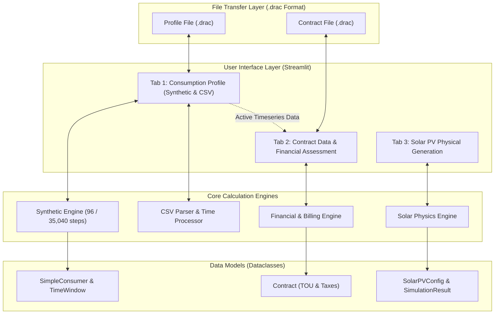

# Energy Simulator & Load Profile Analyzer — `current_model` Architecture

A modular, enterprise-grade simulation and analytics platform for electrical load profiling, real meter ingestion, electricity supply contract modeling, and Solar PV generation analysis.

---

## 🎨 UI Iconography & Styling Policy (Mandatory Guidelines)

> [!IMPORTANT]
> **Icon Standard:** To maintain a clean, professional, and subtle aesthetic, **only Font Awesome 6, Remix Icon, and Flag Icons** must be used across all components, headers, and buttons.
> 
> * **Prohibited:** Colorful cartoon emojis (e.g. 🍇, 🏭, 🏢, 📁, 📥, 📤, 💾) must **never** be used in user-facing controls, tables, or presets.
> * **Vector Icons:** Use CSS classes from **Font Awesome 6** (`fa-solid fa-...`) and **Remix Icon** (`ri-...-line`).
> * **Country Flags:** Use vector **Flag Icons** (`fi fi-<country_code>`) from `flag-icons`. Emoji country flags are permitted only as a fallback if a specific country flag is unavailable in the vector library.

The stylesheets are globally injected via [`ui/common/styles.py`](file:///c:/Users/mwien/Documents/One%20drive2/OneDrive/Desktop/Arbeit%20prog/Web%20Development/entwuerfe/current_model/ui/common/styles.py):
* Font Awesome 6: `<link rel="stylesheet" href="https://cdnjs.cloudflare.com/ajax/libs/font-awesome/6.5.1/css/all.min.css">`
* Remix Icon 4: `<link rel="stylesheet" href="https://cdn.jsdelivr.net/npm/remixicon@4.2.0/fonts/remixicon.css">`
* Flag Icons: `<link rel="stylesheet" href="https://cdn.jsdelivr.net/gh/lipis/flag-icons@7.2.3/css/flag-icons.min.css">`

---

## ⚡ Quick-Lookup Directory Map (1:1 Visual-to-Code Mapping)

Every top-level Tab in the Streamlit application corresponds directly to its dedicated directory under `ui/`:

| UI Area / Component | Description & Responsibility | File Path |
| :--- | :--- | :--- |
| **Main Application Entry** | Top-level orchestrator & Tab navigation | [`app.py`](file:///c:/Users/mwien/Documents/One%20drive2/OneDrive/Desktop/Arbeit%20prog/Web%20Development/entwuerfe/current_model/app.py) |
| **Global Theme & Styles** | Dark mode CSS, card classes, and icon CDNs | [`ui/common/styles.py`](file:///c:/Users/mwien/Documents/One%20drive2/OneDrive/Desktop/Arbeit%20prog/Web%20Development/entwuerfe/current_model/ui/common/styles.py) |
| **Shared KPI Components** | Metric cards (`render_kpi_card`) with status badges | [`ui/common/cards.py`](file:///c:/Users/mwien/Documents/One%20drive2/OneDrive/Desktop/Arbeit%20prog/Web%20Development/entwuerfe/current_model/ui/common/cards.py) |
| **Tab 1: Consumption** | Top-level switcher: Synthetic Simulator vs. Real Meter CSV | [`ui/tab1_consumption/view.py`](file:///c:/Users/mwien/Documents/One%20drive2/OneDrive/Desktop/Arbeit%20prog/Web%20Development/entwuerfe/current_model/ui/tab1_consumption/view.py) |
| **Tab 1: Synthetic View** | 24h & 365d simulation orchestrator, KPIs, and `.drac` toolbar | [`ui/tab1_consumption/synthetic/view.py`](file:///c:/Users/mwien/Documents/One%20drive2/OneDrive/Desktop/Arbeit%20prog/Web%20Development/entwuerfe/current_model/ui/tab1_consumption/synthetic/view.py) |
| **Tab 1: Synthetic Forms** | Add/edit consumer asset forms, operating windows, weekly schedules | [`ui/tab1_consumption/synthetic/forms.py`](file:///c:/Users/mwien/Documents/One%20drive2/OneDrive/Desktop/Arbeit%20prog/Web%20Development/entwuerfe/current_model/ui/tab1_consumption/synthetic/forms.py) |
| **Tab 1: Synthetic Charts** | Plotly 24h stacked area, 365d timeseries & 2D heatmap | [`ui/tab1_consumption/synthetic/charts.py`](file:///c:/Users/mwien/Documents/One%20drive2/OneDrive/Desktop/Arbeit%20prog/Web%20Development/entwuerfe/current_model/ui/tab1_consumption/synthetic/charts.py) |
| **Tab 1: CSV Inspector** | Ingestion pipeline, multi-meter viewer, and overload analyzer | [`ui/tab1_consumption/csv_inspector/view.py`](file:///c:/Users/mwien/Documents/One%20drive2/OneDrive/Desktop/Arbeit%20prog/Web%20Development/entwuerfe/current_model/ui/tab1_consumption/csv_inspector/view.py) |
| **Tab 1: CSV Forms** | File upload widget, delimiter sniffer, and column mapping | [`ui/tab1_consumption/csv_inspector/forms.py`](file:///c:/Users/mwien/Documents/One%20drive2/OneDrive/Desktop/Arbeit%20prog/Web%20Development/entwuerfe/current_model/ui/tab1_consumption/csv_inspector/forms.py) |
| **Tab 1: CSV Charts** | High-performance interactive multi-channel timeseries chart | [`ui/tab1_consumption/csv_inspector/charts.py`](file:///c:/Users/mwien/Documents/One%20drive2/OneDrive/Desktop/Arbeit%20prog/Web%20Development/entwuerfe/current_model/ui/tab1_consumption/csv_inspector/charts.py) |
| **Tab 2: Contract Data** | Billing assessment orchestrator, monthly series & KPIs | [`ui/tab2_contract/view.py`](file:///c:/Users/mwien/Documents/One%20drive2/OneDrive/Desktop/Arbeit%20prog/Web%20Development/entwuerfe/current_model/ui/tab2_contract/view.py) |
| **Tab 2: Contract Form** | Electricity tariff configuration form & `.drac` file transfer bar | [`ui/tab2_contract/form.py`](file:///c:/Users/mwien/Documents/One%20drive2/OneDrive/Desktop/Arbeit%20prog/Web%20Development/entwuerfe/current_model/ui/tab2_contract/form.py) |
| **Tab 2: Financial Charts** | Cost distribution donut chart and monthly payment schedule series | [`ui/tab2_contract/charts.py`](file:///c:/Users/mwien/Documents/One%20drive2/OneDrive/Desktop/Arbeit%20prog/Web%20Development/entwuerfe/current_model/ui/tab2_contract/charts.py) |
| **Tab 3: Solar PV** | Solar PV generation simulator, irradiance & KPI dashboard | [`ui/tab3_solar/view.py`](file:///c:/Users/mwien/Documents/One%20drive2/OneDrive/Desktop/Arbeit%20prog/Web%20Development/entwuerfe/current_model/ui/tab3_solar/view.py) |
| **Tab 3: Solar Forms** | Location coordinates, DC sizing, tilt/azimuth & loss factors | [`ui/tab3_solar/forms.py`](file:///c:/Users/mwien/Documents/One%20drive2/OneDrive/Desktop/Arbeit%20prog/Web%20Development/entwuerfe/current_model/ui/tab3_solar/forms.py) |
| **Tab 3: Solar Charts** | Generation timeseries, monthly yield bar chart, and loss waterfall | [`ui/tab3_solar/charts.py`](file:///c:/Users/mwien/Documents/One%20drive2/OneDrive/Desktop/Arbeit%20prog/Web%20Development/entwuerfe/current_model/ui/tab3_solar/charts.py) |
| **Test Suite Runner** | Regression & health-check runner (36 automated tests) | [`run_tests.py`](file:///c:/Users/mwien/Documents/One%20drive2/OneDrive/Desktop/Arbeit%20prog/Web%20Development/entwuerfe/run_tests.py) |

---

## 🏗️ System Architecture & Inner Workings



---

## 🧩 Detailed Module Breakdown

### 1. Tab 1: Consumption Modeling & Real Meter Ingestion
* **Bottom-Up Synthetic Simulation ([`core/synthetic_engine.py`](file:///c:/Users/mwien/Documents/One%20drive2/OneDrive/Desktop/Arbeit%20prog/Web%20Development/entwuerfe/current_model/core/synthetic_engine.py))**:
  * **24-Hour Profile**: Generates 96 fifteen-minute power intervals ($kW$) for typical daily operational profiles.
  * **Full Year (365 Days / 35,040 Steps)**: Vectorized calculation applying weekday masks (0=Monday..6=Sunday), startup inrush spikes, monthly seasonal scaling factors (e.g. summer/winter shifts), and system-wide custom holidays (treated automatically as Sundays).
* **CSV Real-Meter Parser ([`core/csv_parser.py`](file:///c:/Users/mwien/Documents/One%20drive2/OneDrive/Desktop/Arbeit%20prog/Web%20Development/entwuerfe/current_model/core/csv_parser.py))**:
  * Auto-detects delimiters (`,`, `;`, `\t`), European comma decimals (`1.234,56`), and Spanish/English timestamp column formats.
  * Scales energy intervals into active power demand ($15\text{-min-kWh} \times 4 \to \text{kW}$).
* **Grid Capacity Overload Analysis ([`models/grid_limit.py`](file:///c:/Users/mwien/Documents/One%20drive2/OneDrive/Desktop/Arbeit%20prog/Web%20Development/entwuerfe/current_model/models/grid_limit.py))**:
  * Analyzes power curves against contracted physical connection limits, reporting peak overload ($kW$), duration ($hours$), and excess energy ($kWh$).

---

### 2. Tab 2: Electricity Contract & Billing Engine
* **Contract Model ([`models/contract.py`](file:///c:/Users/mwien/Documents/One%20drive2/OneDrive/Desktop/Arbeit%20prog/Web%20Development/entwuerfe/current_model/models/contract.py))**:
  * **Capacity & Base Charges**: Fixed monthly base fee ($/month$), contracted active capacity charge ($/kW/month$), and measured peak demand charge ($/kW/month$).
  * **Dynamic Time-of-Use (TOU) Rates**: Configurable table of tariff windows (e.g. *Pico* 18:00–23:00, *Valle* 23:00–05:00, *Resto* 05:00–18:00) with overnight-shift support and optional weekend off-peak rules.
  * **Power Factor & Reactive Penalties**: Cos $\phi$ threshold evaluation and reactive energy tariffs ($/kVARh$).
  * **Dynamic Taxes & Surcharges**: Customizable taxes supporting percentage rates (e.g. VAT 27%, Provincial 9%), per-kWh levies, and fixed monthly charges.
* **Financial Engine ([`core/financial_engine.py`](file:///c:/Users/mwien/Documents/One%20drive2/OneDrive/Desktop/Arbeit%20prog/Web%20Development/entwuerfe/current_model/core/financial_engine.py))**:
  * Automatically binds to the active load profile from Tab 1.
  * Computes itemized line items, effective unit prices ($/kWh$), fixed vs. variable cost splits, and full-duration month-by-month payment schedules (*Zahlungsreihe*).
* **Presets Library**:
  * Includes ready-to-use industry contracts such as `Paula1 (Bodegas Salentein - EDEMSA T2 R MT)` (ARS), `Industrial Multi-Tariff` (EUR), `Commercial Standard Fixed` (EUR), and `Argentine T3 Grandes Demandas` (ARS).

---

### 3. Tab 3: Solar PV Physical Generation Simulation
* **Solar Physics Engine ([`core/solar_engine.py`](file:///c:/Users/mwien/Documents/One%20drive2/OneDrive/Desktop/Arbeit%20prog/Web%20Development/entwuerfe/current_model/core/solar_engine.py))**:
  * Models solar geometry (tilt, azimuth, solar elevation, solar zenith).
  * Direct Normal (DNI), Diffuse Horizontal (DHI), and Global Horizontal (GHI) irradiance transposition onto tilted planes.
  * Cell temperature derating based on ambient temperature and Nominal Module Operating Temperature (NMOT).
  * Inverter efficiency conversion and clipping power thresholds ($kW_{AC}$ limit).
  * Calculates Key Performance Indicators (KPIs): Specific Yield ($kWh/kWp/year$), Performance Ratio ($PR$), Capacity Factor ($\%$) and Full Load Hours ($h/a$).

---

## 💾 The `.drac` File Format Standard

Both Electricity Contracts and Synthetic Load Profiles can be exported with custom names and imported using the proprietary **`.drac`** JSON format:

### Contract Schema (`.drac`):
```json
{
  "format": "drac_contract",
  "version": "1.0",
  "name": "Paula1",
  "currency": "ARS",
  "base_monthly_fee": 514145.55,
  "contracted_capacity_kw": 430.0,
  "monthly_capacity_tariff": 40607.046,
  "demand_capacity_tariff": 8554.439,
  "max_physical_limit_kw": 1000.0,
  "peak_penalty_rate": 40607.046,
  "reactive_power_tariff": 0.0,
  "min_power_factor": 0.90,
  "reactive_power_allowance_pct": 33.0,
  "tou_rates": [
    {"name": "Valle (23:00 - 05:00)", "rate": 66.1017, "start_time": "00:00", "end_time": "05:00"},
    {"name": "Resto (05:00 - 18:00)", "rate": 66.7737, "start_time": "05:00", "end_time": "18:00"},
    {"name": "Pico (18:00 - 23:00)", "rate": 68.4335, "start_time": "18:00", "end_time": "23:00"},
    {"name": "Valle (23:00 - 05:00)", "rate": 66.1017, "start_time": "23:00", "end_time": "24:00"}
  ],
  "default_energy_rate": 66.7737,
  "weekend_is_off_peak": false,
  "taxes_and_fees": [
    {"name": "I.V.A. Resp. Inscripto", "type": "percentage", "value": 27.0, "description": "IVA Nacional"},
    {"name": "CCCE art 74 inc d) Ley 6497", "type": "percentage", "value": 9.0, "description": "Fondo Compensador Provincial"},
    {"name": "Cargo AP Municipal Ord. 3028", "type": "fixed_monthly", "value": 43091.0, "description": "Alumbrado Público"}
  ]
}
```

### Load Profile Schema (`.drac`):
```json
{
  "format": "drac_load_profile",
  "version": "1.0",
  "profile_name": "Winery Bottling Facility",
  "consumer_count": 4,
  "consumers": [
    {
      "name": "Bottling Line A",
      "power_kw": 120.0,
      "category": "Production",
      "count": 1,
      "active_days": [0, 1, 2, 3, 4],
      "time_windows": [
        {
          "start_time": "06:00",
          "end_time": "15:00",
          "has_peak": true,
          "peak_power_kw": 150.0,
          "peak_duration_min": 30
        }
      ]
    }
  ]
}
```

---

## 🧪 Automated Testing Suite

Execute the health check and regression suite from the project root:

```bash
python run_tests.py
```

The suite covers **36 automated unit tests** across:
* `.drac` serialization, deserialization, and round-trip fidelity.
* Backward compatibility and state migration.
* Vectorized 24h and 365-day annual load aggregation.
* Dynamic Time-of-Use rate matching and weekend off-peak logic.
* Financial billing calculations and multi-month invoice series.
* CSV delimiter heuristics and decimal normalization.
* Solar PV physical modeling, irradiance transposition, and temperature derates.
* Python syntax and compilation check across the entire workspace.
