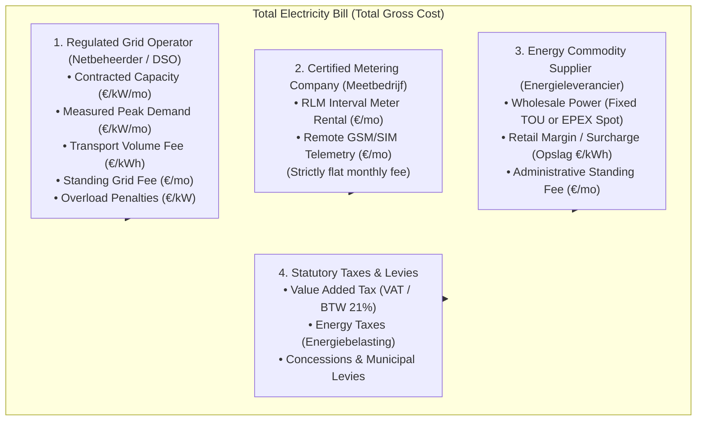

# :material/science: UI Sandbox & 3-Party Contract Laboratory (`ui_sandbox`)

An isolated, enterprise-grade sandbox environment for testing 15-minute interval CSV consumption profiles, configuring unbundled European **3-Party Electricity Contracts**, and evaluating 12-month commercial tariff baselines **without having to run `app.py`**.

---

## :material/verified_user: Architectural Rules & Isolation Boundary

> [!IMPORTANT]
> **Strict One-Way Dependency Isolation:**
> 1. **Allowed (`ui_sandbox` $\rightarrow$ Project):** Code inside `ui_sandbox/` is permitted to import domain engines, styles, and models from `core/`, `models/`, and `ui/` to test live functionality.
> 2. **Strictly Prohibited (Main Project $\rightarrow$ `ui_sandbox`):** The production application (`app.py`), core calculation engines, domain models, or production UI tabs must **NEVER** import or reference anything located in `ui_sandbox/`.
> 3. **Design Standards:** All UI prototypes must strictly adhere to the project's iconography standard (**Streamlit native Google Material Symbols `:material/<icon_name>:`**, zero cartoon emojis) and English UI text.

---

## :material/folder_open: Directory Structure

```text
current_model/ui_sandbox/
├── __init__.py                           # Module package initializer
├── sandbox_app.py                        # Standalone Streamlit test runner & suite selector
├── minimal_contract_system.py            # 3-Party Unbundled Contract Lab (15-min interval CSV + DSO + Meetbedrijf + Supplier)
├── standalone_monthly_baseline_lab.py    # Lean coordinator for the 12-Month Baseline & Tariff Lab
├── monthly_presets.py                    # Standard contract presets & Dutch DSO rate catalogs (Enexis & Liander 2025)
├── monthly_calc.py                       # Pure mathematical billing calculation engine & dataclass models
├── monthly_header_view.py               # Presets toolbar, reload engine, and currency / FX converter
├── monthly_editors.py                    # Dual interactive data editors (Table A Consumption & Table B Tariffs)
├── monthly_charts.py                     # Plotly interactive stacked billing & energy volume charts
├── monthly_audit.py                      # Step-by-step mathematical arithmetic & audit panel
├── monthly_financial_view.py             # 4 Financial KPI cards & CSV/JSON export toolbar
├── monthly_tou_manager.py                # Optional dynamic Time-of-Use (TOU) window manager
├── monthly_dso_generator.py              # Optional Dutch Grid Operator Tariff Generator (Enexis & Liander 2025)
└── README.md                             # Sandbox architecture & 3-party market unbundling guide
```

---

## :material/play_arrow: Quick Start & Execution

You can run any sandbox laboratory directly with Streamlit:

### 1. Run the Suite Runner (Switch between both labs):
```bash
python -m streamlit run current_model/ui_sandbox/sandbox_app.py
```

### 2. Run the 3-Party Unbundled Contract Lab directly (15-min CSV Profile):
```bash
python -m streamlit run current_model/ui_sandbox/minimal_contract_system.py
```

### 3. Run the 12-Month Baseline & Commercial Tariff Lab directly:
```bash
python -m streamlit run current_model/ui_sandbox/standalone_monthly_baseline_lab.py
```

---

## :material/account_balance: The European 3-Party Market Unbundling Model

### Why is the Electricity Market Unbundled?
Under European Union Energy Directives (Directive 2009/72/EC and Directive (EU) 2019/944), national legislation (such as the Dutch *Elektriciteitswet 1998* and the German *Energiewirtschaftsgesetz - EnWG 2005*) strictly mandates **legal and operational unbundling**. 

Monopolistic network infrastructure must be legally and operationally decoupled from competitive commercial energy trading and independent metering services. When a Commercial & Industrial (C&I) company in the Netherlands, Germany, or the UK receives its electricity bills, the total cost originates from **three legally independent market entities** plus statutory government levies:



---

### Detailed Breakdown of the Three Parties

#### 1. Regulated Distribution System Operator (DSO / Netbeheerder)
* **Entities:** *Liander Netbeheer*, *Enexis Netbeheer*, *Stedin*, *Netze BW*, *EDEMSA*.
* **Market Role:** Operates and maintains the physical electrical grid infrastructure (substations, transformers, transmission lines). It operates as a regulated natural monopoly overseen by national utility regulators (e.g., ACM in the Netherlands, Bundesnetzagentur in Germany).
* **Cost Components:**
  * **Contracted Capacity Tariff ($P_{\text{contract}}$ in kW):** Monthly fee billed per reserved transformer capacity (*capaciteitstarief*), e.g., € 2.2233/kW/month for Liander MS.
  * **Measured Peak Demand Tariff ($P_{\text{max}}$ in kW):** Monthly fee billed per highest recorded 15-minute demand peak (*piekvermogenstarief*), e.g., € 3.4600/kW/month for Liander MS.
  * **Network Volume Transport Fee ($E$ in kWh):** Regulated per-kWh transport fee for power delivered through the network (*netwerkkosten / Netznutzung*), e.g., € 0.0220/kWh.
  * **Grid Standing Charge:** Fixed monthly connection maintenance fee (e.g., € 36.75/month for Liander MS).
  * **Overload Penalties:** Punitive rate billed per kW exceeding the booked transformer capacity ($\max(0, P_{\text{max}} - P_{\text{contract}})$).

#### 2. Certified Metering Company (Meetbedrijf / Messstellenbetrieb)
* **Entities:** *Fudura B.V.*, *Kenter B.V.*, *Joulz*, *Infraserv*.
* **Market Role:** Accredited commercial service entity responsible for installing, calibrating, maintaining, and certifying the physical interval telemetry meter (RLM meter) and transmitting certified 15-minute load profiles to the central energy clearing clearinghouse (NEDU / TenneT).
* **Cost Components:**
  * **Strictly Flat Monthly Fee:** Fast ausnahmslos eine **reine monatliche Fixpauschale** (typically € 40.00 to € 150.00/month for C&I customers). 
  * **Independence from Load:** This fee has **zero dependence** on how many kWh are consumed or how high the customer's peak kW reaches. A Battery Energy Storage System (BESS) or Solar PV plant cannot reduce this metering fee.

#### 3. Competitive Energy Commodity Supplier (Energieleverancier)
* **Entities:** *Eneco Zakelijk*, *Vattenfall Zakelijk*, *Shell Energy*, *TotalEnergies*, *E.ON*.
* **Market Role:** Commercial electricity retailer that purchases power on the wholesale exchange or through Power Purchase Agreements (PPAs) and sells it to the end consumer.
* **Cost Components:**
  * **Commodity Energy Pricing:**
    * **Dynamic Spot Market:** Linked directly to hourly wholesale auction prices on the Day-Ahead power exchange (EPEX Spot NL 2025).
    * **Fixed Time-of-Use (TOU):** Fixed price tiers per time window (e.g., Peak / Piek vs. Off-Peak / Dal).
  * **Supplier Margin / Surcharge (*Opslag* in €/kWh):** The retailer's commercial markup on every kWh procured (typically € 0.0050 to € 0.0150/kWh, e.g., € 0.0075/kWh).
  * **Administrative Standing Fee:** Fixed monthly customer service and invoicing charge (typically € 10.00 to € 25.00/month).

#### 4. Statutory Taxes & Dynamic Levies
* **VAT / BTW:** Statutory Value Added Tax (e.g., 21.0% in NL, 19.0% in DE, 27.0% in AR).
* **Energy Taxes:** Quantity-based environmental levies (*Energiebelasting*, *Stromsteuer*).

---

## :material/featured_play_list: Laboratory Features & Capabilities

### 1. 3-Party Contract & Load Profile Lab (`minimal_contract_system.py`)
* **15-Minute Load Profile Ingestion:** Upload CSV meter files with auto-delimiter detection, European comma conversion, and timeseries visualization.
* **Domain Model (`ThreePartyContract`):**
  * Extends the base `Contract` model without breaking serialization.
  * Encapsulates `dso_name`, `connection_category`, `meter_company_name`, `metering_monthly_fee`, `supplier_name`, and `supplier_base_fee_monthly`.
  * Serializes cleanly to standard `.drac` files.
* **Calculation Engine (`compute_three_party_financial_bill`):**
  * Evaluates 15-minute consumption against EPEX Spot Day-Ahead wholesale prices or fixed TOU windows.
  * Accurately itemizes Meetbedrijf and Supplier standing charges alongside regulated DSO capacity charges.
* **Plotly Visualizations:**
  * **3-Party Cost Distribution Donut Chart:** Dedicated color-coded segments for Commodity Energy (Sky Blue), DSO Capacity (Amber), DSO Transport (Cyan), Meetbedrijf (Fuchsia `#D946EF`), Supplier (Indigo `#6366F1`), and Taxes (Emerald).
  * **12-Month Payment Schedule Series (Zahlungsreihe):** Stacked bar chart showing monthly billing progression.
  * **Unbundled Itemized Billing Statement:** Formatted table showing basis quantities, unit rates, period totals, monthly totals, and percentage shares.
* **Industry Presets:**
  * `Netherlands 3-Party Dynamic (Liander MS + Eneco + Fudura)`
  * `Netherlands 3-Party Fixed TOU (Enexis MS-D + Vattenfall + Kenter)`
  * `Germany Industrial 3-Party (Netze BW + E.ON + Infraserv)`
  * `Bodegas Salentein (EDEMSA T2 R MT - Argentina)`
  * `Standard Commercial Utility Contract (Baseline)`

---

### 2. Autarkic 12-Month Baseline & Tariff Lab (`standalone_monthly_baseline_lab.py`)
* **3-Party Market Entities & Contract Attribution:**
  * **Header Configuration Card:** Explicitly displays and allows customization of the 3 unbundled parties:
    * **Regulated Grid Operator (DSO / Netbeheerder):** e.g., Liander Netbeheer B.V., Enexis Netbeheer B.V., EDEMSA Mendoza.
    * **Energy Commodity Supplier (Energieleverancier):** e.g., Eneco Zakelijk, Vattenfall Zakelijk, EDEMSA Suministro.
    * **Certified Meter Company (Meetbedrijf):** e.g., Fudura B.V., Kenter B.V., EDEMSA Medición, including monthly telemetry & meter rental fee (€/month).
  * **Table B (Tariff Matrix) 3-Party Column Attribution:**
    * `DSO Base Fee (EUR/mo)`: Regulated standing grid connection charge.
    * `Meetbedrijf Meter Fee (EUR/mo)`: Dedicated certified metering and interval telemetry fee.
    * `DSO Capacity (EUR/kW)`: Reserved transformer capacity rate.
    * `DSO Over Limit (EUR/kW)`: Peak capacity exceedance penalty rate.
    * `DSO Peak Demand (EUR/kW)`: Monthly measured maximum demand rate.
    * `Supplier <Tier> (EUR/kWh)`: Active energy commodity rate per TOU window.
    * `Statutory Taxes (%)`: VAT and energy taxes applied to energy and grid components.
  * **Financial Attribution Banner:** Clean 3-party KPI breakdown showing exact EUR amounts and percentage shares for DSO, Supplier, and Meetbedrijf.
  * **Stacked Billing Chart:** Meetbedrijf metering fee clearly visualized with dedicated Fuchsia `#D946EF` bar trace.
  * **Statement & Audit Integration:** Formatted billing statement and mathematical audit explicitly show Meetbedrijf metering fee alongside DSO and Supplier line items.
* **Exact Mathematical Target Reproduction:**
  * Replicates the original Bodegas Salentein (*Pozo 600*) dataset (Excel Blatt 1.1 & 1.3) down to the cent:
    * High-peak energy cost (88,002 kWh × € 0.182529/kWh): **€ 16,062.92**
    * Low-peak energy cost (133,848 kWh × € 0.113215/kWh): **€ 15,153.66**
    * Annual fixed standing & network charges: **€ 5,018.40**
    * **Cent-precise Grand Total: € 36,234.97** (automated verification badge: deviation $< 0.01\text{ €}$).
* **Modularized Sub-Components:**
  * `monthly_presets.py`: Enexis 2025 and Liander 2025 rate catalogs, Salentein and Argentine presets, and `get_preset_three_party_entities()` mapping.
  * `monthly_calc.py`: Pure mathematical billing engine, dataclasses (`MonthlyBillingResult`, `AnnualBillingSummary`), statement builder, JSON serializer, and unbundled 3-party cost aggregations.
  * `monthly_header_view.py`: Preset toolbar, reload button, currency & FX converter, and 3-Party Market Entities configuration card.
  * `monthly_editors.py`: Interactive dual data editors for Table A and Table B with 3-party column headers and tooltip descriptions.
  * `monthly_charts.py`: Plotly stacked cost composition (with Meetbedrijf trace) and volume charts.
  * `monthly_audit.py`: Detailed step-by-step arithmetic verification panel with DSO, Supplier, and Meetbedrijf breakdowns.
  * `monthly_financial_view.py`: 4 financial KPI cards, 3-Party Cost Attribution banner, and CSV/JSON export toolbar.
  * `monthly_tou_manager.py` & `monthly_dso_generator.py`: Sub-modules available modularly.

---

## :material/check_circle: Quality Assurance & Automated Testing

All sandbox functionality is verified through automated unit tests in `current_model/tests/`:
```bash
python current_model/run_tests.py
# or
python -m pytest current_model/tests/ -v
```
- **160 / 160 Unit Tests Passing** (0 Failures, 0 Errors).
- **Pozo 600 Benchmark (€ 36,234.97):** Cent-precise mathematical reproduction verified.
- **Isolation Verification (`test_ui_sandbox.py`):** AST parsing verifies that production modules (`app.py`, `core/`, `models/`, `ui/`) never import anything from `ui_sandbox/`.
